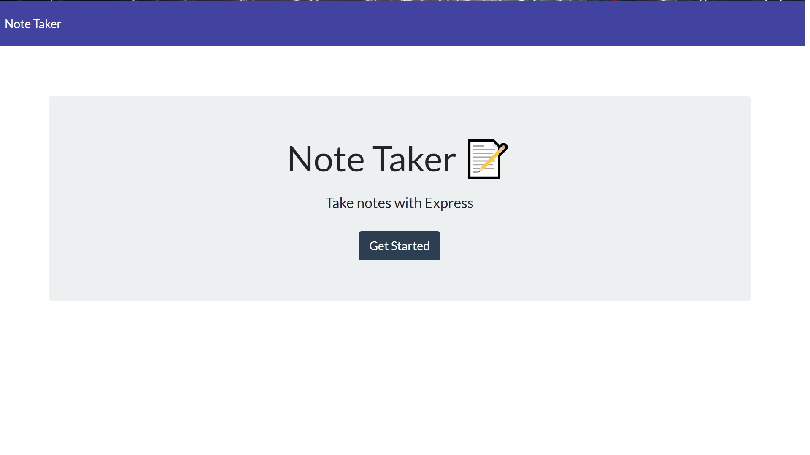
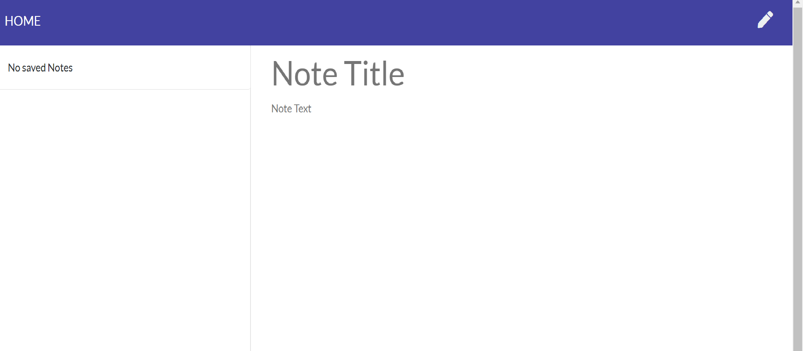
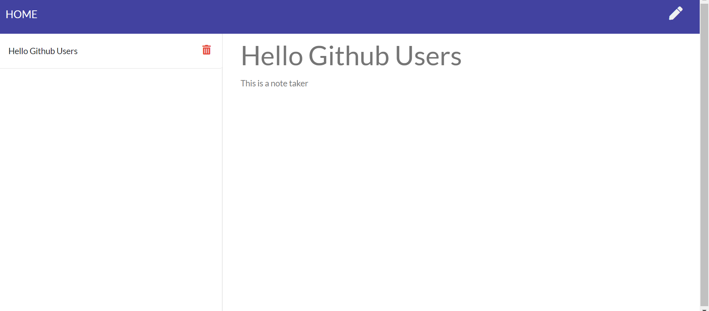

# Express: Note Taker

## Screenshot

## Overview

An application that can be used to write, save, and delete notes. The application uses an express backend to save and retrieve note data from a JSON file.

## User Story

AS a user, I want to be able to write and save notes. Also, be able to delete notes I've written before as I organize my thoughts and keep track of tasks I need to complete.

## Business Context

For users that need to keep track of a lot of information, it's easy to forget or be unable to recall something important. Being able to take persistent notes allows users to have written information available when needed.

## License

## Info / Questions

- [Devonte Letts](https://github.com/Duhhvonte)
- devonte.letts@gmail.com
